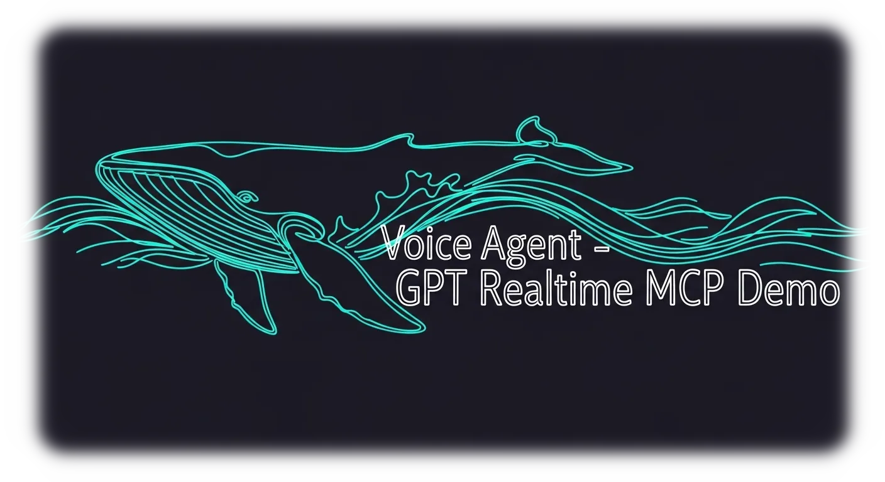

<div align="center">

# 🎤 Voice Agent – Realtime Demo



<p>
  
  
  
</p>
OpenAI Realtime API voice demo with optional MCP tool integration.

</div>


## 🌐 概要
`index.html` はブラウザ単体のデモ、`frontend.html` はローカルサーバー経由でエフェメラルトークンを取得するデモです。`server.js` が静的ファイル提供と `/token` プロキシを担い、OpenAI Realtime モデルに Hugging Face MCP ツールを公開します。

## 🛠️ 要件
- Node.js 18 以降
- npm
- Realtime API にアクセスできる OpenAI API キー

## 🚀 クイックスタート
1. 依存パッケージをインストールします。
   ```cmd
   npm install
   ```
2. `.env` を作成し、以下の環境変数を設定します。
   ```env
   OPENAI_API_KEY=sk-replace-with-your-key
   MCP_SERVER_URL=https://makiai-get-time-mcp.hf.space/gradio_api/mcp/
   MCP_SERVER_LABEL=hf-get-time
   MCP_REQUIRE_APPROVAL=never
   # MCP_AUTHORIZATION=Bearer example-token (必要な場合のみ)
   ```
3. サーバーを起動します。
   ```cmd
   npm start
   ```
4. ブラウザで http://localhost:3000 または http://localhost:3000/frontend.html にアクセスし、Realtime セッションを開始します。

## ⚙️ 環境変数
| 変数 | 必須 | 説明 |
| --- | --- | --- |
| `OPENAI_API_KEY` | ✅ | Realtime API にアクセスするための OpenAI キー。ローカルの `.env` にのみ保存してください。 |
| `MCP_SERVER_URL` | ✅ | 公開されている MCP エンドポイント (例: Hugging Face Space)。 |
| `MCP_SERVER_LABEL` | ✅ | クライアントに表示する MCP サーバー名。 |
| `MCP_REQUIRE_APPROVAL` | ✅ | MCP ツール呼び出し時の承認モード。デモでは `never` を使用します。 |
| `MCP_AUTHORIZATION` | ⛔️ | エンドポイントが追加認証を要求する場合のみ設定。未使用時は削除できます。 |

`.env.example` にサンプル値を揃えているので、必要項目の確認に活用してください。

## 🔧 仕組み
- ブラウザデモは `/token` にリクエストし、サーバーが `https://api.openai.com/v1/realtime/client_secrets` へ POST してエフェメラルトークンを取得します。
- セッション設定で `tools` に MCP サーバーを宣言し、必要に応じて `get_time_mcp_get_jp_time` を呼び出します。
- `server.js` は Express で静的ファイルを返しつつ、JSON ボディを 1 MB まで受け付けるよう設定しています。

## 🧪 MCP 検証 (任意)
```powershell
$body = @{ jsonrpc = "2.0"; id = 1; method = "initialize"; params = @{ protocolVersion = "2025-03-26"; clientInfo = @{ name = "curl"; version = "0.1" }; capabilities = @{} } } | ConvertTo-Json -Compress

curl.exe -i `
  -H "Content-Type: application/json" `
  -H "Accept: application/json, text/event-stream" `
  -X POST $env:MCP_SERVER_URL `
  --data $body
```
`200 OK`、`Content-Type: text/event-stream`、`mcp-session-id` ヘッダが返れば接続成功です。

## 🩺 トラブルシューティング
- `/token` が 401/403 を返す場合は API キーの権限と `.env` 設定を再確認してください。
- セッションが確立しても MCP ツールが呼ばれない場合は `MCP_SERVER_URL` が外部公開されているか確認してください。
- 新しいツールを追加する際は、MCP サーバー側で公開した後 `.env` を更新しサーバーを再起動します。

## 🔐 セキュリティメモ
- 実際の API キーは決してリポジトリにコミットしないでください。`.env` を `.gitignore` に含めて運用します。
- 外部デプロイ時は HTTPS を使い、信頼できるクライアントにのみエフェメラルトークンを配布してください。
- 必要に応じて `MCP_AUTHORIZATION` を利用し、ツール呼び出しを保護してください。

## 📸 スクリーンショット
| *アプリの操作画面スクリーンショットをここに追加してください。* |
| :--: |


